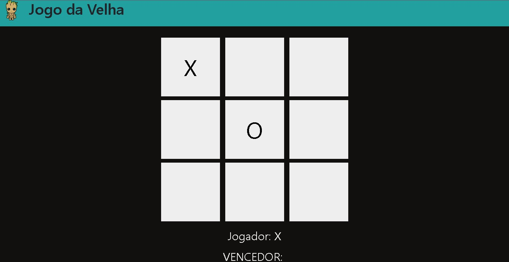
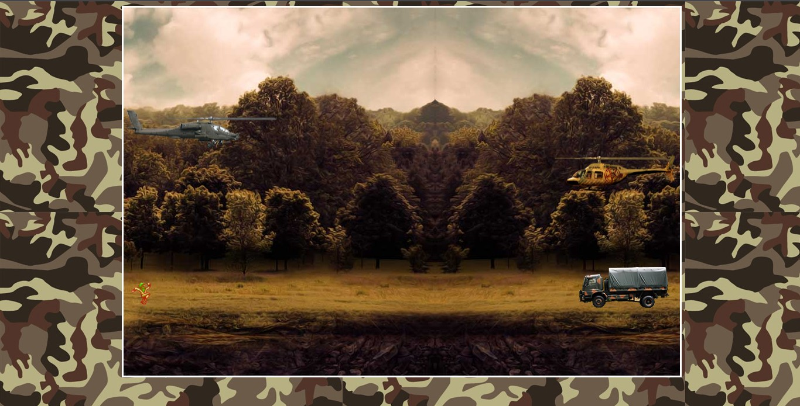

# Games_HTML
Jogos simples em linguagem HTML e Javascript

### Ajustes e melhorias

O projeto ainda está em desenvolvimento e as próximas atualizações serão voltadas nas seguintes tarefas:

- [x] Desenvolver jogo da velha utilizando js
<br>


- [ ] Desenvolver jogo de naves com o Jquery `(em desenvolvimento)`
<br>


- [ ] Desenvolver jogo da memória

- [ ] Desenvolver jogo espacial

- [ ] Desenvolver jogo dinossauro Google

- [ ] Unir todos os jogos em um único HTML

## 💻 Pré-requisitos

Até agora nada

## 🚀 Instalando Games_HTML

Para instalar o <Games_HTML>, siga estas etapas:

Linux e Windows:
```
git clone https://github.com/joaovaladao/Games_HTML.git
```

## 🤝 Colaboradores

Agradecemos às seguintes pessoas que contribuíram para este projeto:

<table>
  <tr>
    <td align="center">
      <a href="#">
        <br>
        <sub>
          <b>João Victor Valadão</b>
        </sub>
      </a>
    </td>
  </tr>
</table>